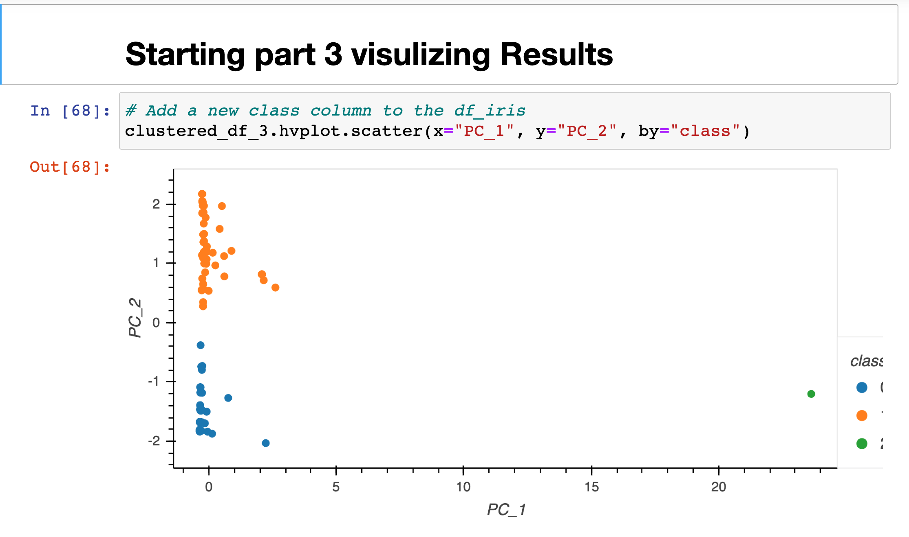

# -Cryptocurrencies-
mod_18

## Objectives:

### Prepare the data for dimensions reduction with PCA and clustering using K-means.
### Reduce data dimensions using PCA algorithms from sklearn.
### Predict clusters using cryptocurrencies data using the K-means algorithm form sklearn.
### Create some plots and data tables to present your results.

